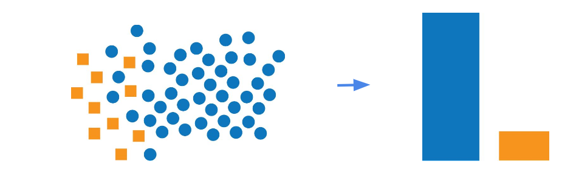

# Class Imbalance

One of the common roadblocks faced by ML Engineers are class imbalances. In this tutorial, we will explore the problem of 
class imbalance and discuss strategies to handle them.

 

 

__What is Class Imbalance?__

Imbalanced datasets are those where the distribution of classes are significantly skewed, with one class being dominant while the others are under represented. Such datasets pose unique challenges when it comes to building effective ML models.

In this tutorial, we will also explore various metrics used to evaluate imbalanced datasets and demonstrate how they provide a more comprehensive evaluation of model performance when compared to accuracy.

The metrics we will explore are as follows - 
- Precision
- Recall
- F1 Score
- ROC Curve

Finally, we will conclude this tutorial by exploring various strategies to overcome the challenges posed by imbalanced datasets and improve the performance of our machine learning models.

The strategies which will be covered are -
- Resampling Techniques
- Ensemble Methods
- Cost Sensitive Learning

So let's get started!